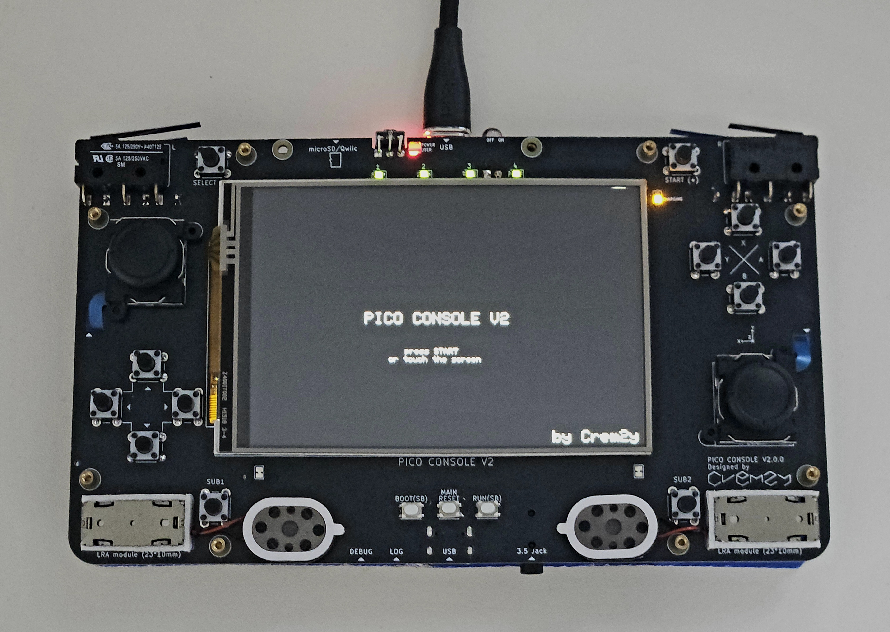

# pico-console V2



A custom-built handheld console platform based on a multi-MCU architecture.

The system is built around two RP2350 microcontrollers:
one acting as the main processor and the other as a dedicated southbridge.

This project focuses on scalable embedded system design, including multi-processor coordination, custom protocols, and full-stack bare-metal development.

For the previous version of this project, see [pico-console](https://github.com/Crem2y/pico-console).

## Features

- Architecture:
    - Main CPU: RP2350A (at [rp2350a_main_board](https://github.com/Crem2y/rp2350a_main_board))
    - Southbridge: RP2350B (handles input, peripherals, and auxiliary I/O)
    - Custom inter-MCU communication (based on UART)

- Graphics:
    - 480x320 18-bit LCD (50MHz SPI protocol over HSTX)

- Audio:
    - Software mixing pipeline (multi-channel)

- Input:
    - 16 buttons (Nintendo-style ABXY layout)
    - 2 joysticks
    - Touchscreen
    - 6-axis IMU

- Storage:
    - microSD ([carlk3/no-OS-FatFS-SD-SDIO-SPI-RPi-Pico](https://github.com/carlk3/no-OS-FatFS-SD-SDIO-SPI-RPi-Pico))

- Other:
    - Battery monitoring
    - IR communication (RAW, NEC)
    - Designed for extensibility (at southbridge)
        - Qwiic/STEMMA QT Compatible connector
        - HSTX connector (0.5mm pitch 10pin FPC connector)
        - and some GPIO pads..

This project focuses on exploring scalable embedded system design, including multi-processor coordination, custom protocols, and full-stack bare-metal development.

## How to build & upload firmware

1. Install CMake (at least version 3.13), Python 3, and a GCC cross compiler
```bash
sudo apt install cmake python3 build-essential gcc-arm-none-eabi libnewlib-arm-none-eabi libstdc++-arm-none-eabi-newlib
```
2. Clone this repository and submodules:
```bash
git clone --recurse-submodules https://github.com/Crem2y/pico-console-v2.git
```
3. Launch the build script:
```bash
./pico_build.sh
```
4. Press the reset button twice to enter bootloader mode.

5. Upload the generated `.uf2` file to your board.
    - if you already installed [picotool](https://github.com/raspberrypi/picotool), use this.
```bash
./pico_upload.sh
```

6. (Optional) Launch the clean script to remove build artifacts:
```bash
./pico_clean.sh
```

## Photos
- working!

## Schematics & PCB
- See [pico-console-v2-pcb](https://github.com/Crem2y/pico-console-v2-pcb) for details.

---

## License
- This project is licensed under the MIT License.  
- See [LICENSE](./LICENSE) for details.

---

### Third-party components
- Thank you to the many open-source contributors.
- See the `third_party_licenses/` directory for full details.